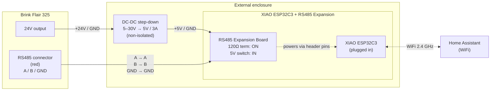

# Wiring diagram — Brink Flair 325 ↔ XIAO ESP32C3 + RS485

External enclosure mounted next to the recovery unit. Power is taken from the unit's 24 V output, stepped down to 5 V/3 A, and fed into the XIAO's `5V` pin. RS485 (A/B/GND) is wired from the unit's red connector to the expansion board's screw terminals.

## Overview



## Detailed wiring

### 1. Power chain (24 V → 5 V → ESP)

| From | To | Wire / note |
|---|---|---|
| Brink Flair `24V` | Step-down `IN+` (Vin) | min. 0.5 mm² |
| Brink Flair `GND` (common) | Step-down `IN−` | min. 0.5 mm² |
| Step-down `OUT+` (5 V) | Expansion board `5V` pin | short, clean ground |
| Step-down `OUT−` (GND) | Expansion board `GND` pin | **must be tied to RS485 GND** (see below) |

> ⚠️ **Important:** The step-down is **non-isolated** — input GND and output GND are the same node. That's fine here because the RS485 GND also rides the same chassis ground, but **make a single star ground point** in the enclosure to avoid ground loops.

### 2. RS485 bus (Brink ↔ Expansion board)

| Brink Flair (red connector) | Expansion board (screw terminal) | Wire |
|---|---|---|
| `A+` | `A` | twisted pair, ≤ 50 cm for the first iteration |
| `B−` | `B` | twisted with the A line |
| `GND` | `GND` | **critical — RS485 is unstable without a shared ground** |

### 3. Expansion board — fixed pin map to the XIAO

These pins are **physically routed on the expansion PCB**; you cannot reassign them. The ESPHome configuration must use them exactly as listed:

| Function | XIAO label | ESP32C3 GPIO | ESPHome YAML key |
|---|---|---|---|
| RS485 RX (from driver) | D4 | **GPIO6** | `uart.rx_pin: GPIO6` |
| RS485 TX (to driver) | D5 | **GPIO7** | `uart.tx_pin: GPIO7` |
| DE/RE flow control | D2 | **GPIO4** | `uart.flow_control_pin: GPIO4` |

> ⚠️ **Heads-up:** The HA community thread mentions GPIO 16/17 — that applies to the classic ESP32 only, **not to the ESP32C3**. The firmware will compile and flash without errors, but Modbus will not communicate.

### 4. Switches and jumpers on the expansion board

| Switch | Position | Reason |
|---|---|---|
| **120 Ω terminator** | **ON** | We are the end node of the bus (and the only one besides the recovery unit). Without termination long cables reflect the signal. |
| **5V OUT/IN** | **IN** | We feed 5 V from the external step-down; the board must not source 5 V back to the supply. |

## ASCII overview

```
       BRINK FLAIR 325                       EXTERNAL ENCLOSURE
   ┌───────────────────────┐         ┌────────────────────────────────────┐
   │                       │         │                                    │
   │  24V ●─────────────────────────►│ IN+  ┌──────────────┐              │
   │                       │         │      │  STEP-DOWN   │              │
   │  GND ●─────────────────────────►│ IN−  │  5–30V → 5V  │              │
   │                       │         │      │     3 A      │              │
   │  ┌─ red connector ────┐         │      └───┬──────┬───┘              │
   │  │                    │         │          │OUT+  │OUT−              │
   │  │   A+ ●─────────────────┐     │      5V │      │ GND               │
   │  │   B− ●───────────────┐ │     │          │      │                   │
   │  │   GND ●─────────────┐│ │     │          ▼      ▼                   │
   │  │                    │││ │     │   ┌──────────────────────────┐    │
   │  └────────────────────┼┼┼─┘     │   │ XIAO RS485 EXPANSION     │    │
   │                       │││       │   │  120Ω switch:    [ON ]   │    │
   └───────────────────────┘││       │   │  5V switch:      [IN ]   │    │
                            ││       │   │                          │    │
                            ││       │   │  Terminals:              │    │
                            │└───────────►│  GND ●                   │    │
                            └────────────►│  B   ●                   │    │
                            ─────────────►│  A   ●                   │    │
                                        │   │                          │    │
                                        │   │  XIAO ESP32C3 socket:    │    │
                                        │   │   D4=GPIO6  ◄── RX       │    │
                                        │   │   D5=GPIO7  ──► TX       │    │
                                        │   │   D2=GPIO4  ──► DE/RE    │    │
                                        │   │   5V pin    ◄── 5V DC    │    │
                                        │   │                          │    │
                                        │   │   ))) WiFi 2.4 GHz )))   │    │
                                        │   └──────────────────────────┘    │
                                        └────────────────────────────────────┘
                                                          │
                                                          ▼
                                                  Home Assistant
```

## Modbus settings on the unit

In the unit's menu (Communication → Bus type), set:

| Parameter | Value |
|---|---|
| Bus type | `modbus` |
| Address | `1` |
| Baud rate | `19k2` (19200) |
| Parity | `NONE` |
| Stop bits | `1` |

## Pre-power-on checklist

1. ☐ With a multimeter, verify the step-down outputs 5.0 V ± 0.1 V **with the XIAO disconnected** (open circuit or with a small dummy load).
2. ☐ Confirm polarity at the XIAO `5V` pin (5 V and GND, not BAT).
3. ☐ The expansion board's `5V OUT/IN` switch **must be set to IN** before connecting the step-down — otherwise the board would back-feed 5 V into the regulator.
4. ☐ A and B are not swapped (sanity-check via the unit's menu, which should show Modbus activity once the ESP boots).
5. ☐ Step-down GND is tied to RS485 GND — single star ground in the enclosure.
6. ☐ Flash the first firmware **over USB** (not OTA) so you can watch the serial log on first boot.

## Next

- [esphome/](../esphome/) will hold the ESPHome dashboard YAML
- [docs/registers.md](registers.md) (to be created) will document the Modbus registers actually working on this specific unit (Modbus enabled without UWA2-B card)
